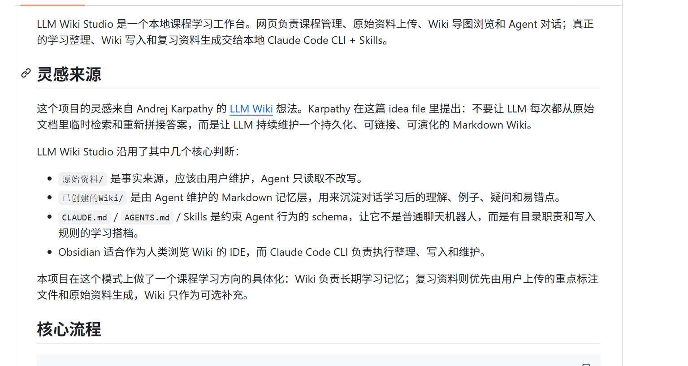

# LLM Wiki Studio



LLM Wiki Studio 是一个本地课程学习工作台。网页负责课程管理、原始资料上传、Wiki 导图浏览和 Agent 对话；真正的学习整理、Wiki 写入和复习资料生成交给本地 Claude Code CLI + Skills。

## 灵感来源

这个项目的灵感来自 Andrej Karpathy 的 [LLM Wiki](https://gist.github.com/karpathy/442a6bf555914893e9891c11519de94f) 想法。Karpathy 在这篇 idea file 里提出：不要让 LLM 每次都从原始文档里临时检索和重新拼接答案，而是让 LLM 持续维护一个持久化、可链接、可演化的 Markdown Wiki。

LLM Wiki Studio 沿用了其中几个核心判断：

- `原始资料/` 是事实来源，应该由用户维护，Agent 只读取不改写。
- `已创建的Wiki/` 是由 Agent 维护的 Markdown 记忆层，用来沉淀对话学习后的理解、例子、疑问和易错点。
- `CLAUDE.md` / `AGENTS.md` / Skills 是约束 Agent 行为的 schema，让它不是普通聊天机器人，而是有目录职责和写入规则的学习搭档。
- Obsidian 适合作为人类浏览 Wiki 的 IDE，而 Claude Code CLI 负责执行整理、写入和维护。

本项目在这个模式上做了一个课程学习方向的具体化：Wiki 负责长期学习记忆；复习资料则优先由用户上传的重点标注文件和原始资料生成，Wiki 只作为可选补充。

## 核心流程

```text
原始资料/
  -> Agent 对话学习
  -> learning-memory-save skill 保存学习记忆到 已创建的Wiki/
  -> review-materials skill 基于重点标注文件 + 原始资料生成 复习资料/
```

## 功能

- 创建本地课程工作区，保持 Markdown / Obsidian 友好的目录结构。
- 上传课程原始资料，支持文本、图片、PDF、音频、视频和 Canvas / Bases 文件。
- 在网页中以对话界面启动本地 Claude Code CLI。
- 通过 `learning-memory-save` skill 把学习对话中的新理解、例子、疑问和易错点保存到 `已创建的Wiki/`。
- 浏览可拖动、可缩放的 Wiki 导图，并点击节点在 Obsidian 中打开对应文档。
- 通过 `review-materials` skill 生成复习资料：每次输出一个文件夹，里面只有 `复习资料.md` 和 `评测报告.md`。

## 复习资料规则

`review-materials` 的输入优先级：

1. 用户上传的重点标注文件：`复习资料/重点文档/` 或 `.llm-wiki/metadata/review-focus.json`
2. 原始资料：`原始资料/`
3. Wiki：`已创建的Wiki/`，仅作为可选补充

`复习资料.md` 的格式固定为：

```text
知识点名称~必考
知识点名称~有可能考
```

Wiki 为空或只有骨架时，也不应阻止复习资料生成。

## 依赖

必需：

- Python 3.11+
- Claude Code CLI，并确保本机可运行 `claude` 或 `claude.cmd`

推荐：

- Obsidian，用于打开和浏览本地 Markdown Wiki

## 启动

```powershell
.\start.ps1
```

浏览器打开：

```text
http://127.0.0.1:8877
```

如果 PowerShell 拦截脚本：

```powershell
powershell -ExecutionPolicy Bypass -File .\start.ps1
```

## 项目结构

```text
浏览器页面
-> server.py 本地 API
-> claude_cli_bridge.py
-> Claude Code CLI
-> 课程目录/
   AGENTS.md
   index.md
   log.md
   原始资料/
   已创建的Wiki/
   复习资料/
   .llm-wiki/
```

项目内 Skills：

```text
.claude/skills/learning-memory-save/
.claude/skills/review-materials/
```

## 隐私说明

仓库不会提交本地运行数据和私密配置：

- `.env`
- `data/`
- Claude Code 会话记录
- 上传的课程资料
- 生成的课程工作区
- 日志和导出包

公开仓库只保留源码、Skills、示例结构和文档。

## 验证

```powershell
& 'C:\Users\28634\.cache\codex-runtimes\codex-primary-runtime\dependencies\python\python.exe' smoke_test.py
```

期望输出：

```text
smoke_test: PASS
```
