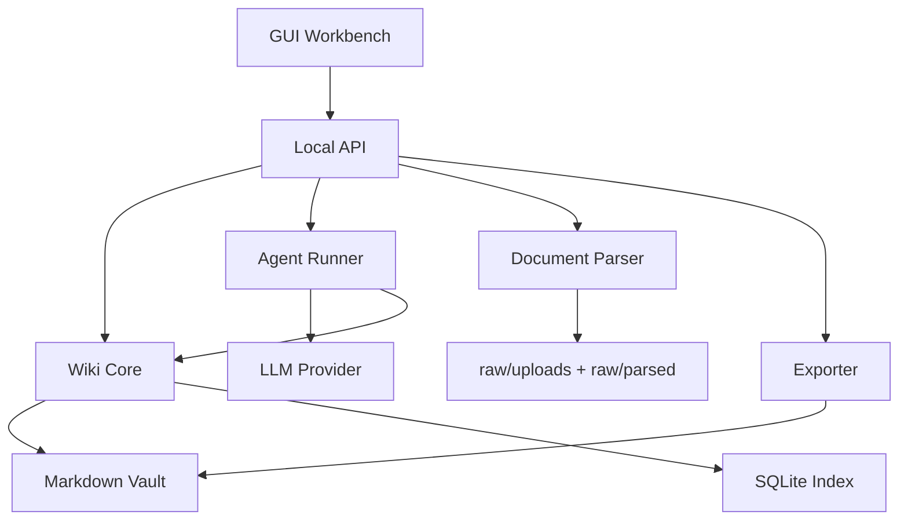

# Architecture

## Target Architecture

## Layers

### Raw Source Layer

Stores user-uploaded files and parsed markdown. This layer is treated as evidence. The agent can read it, but should not rewrite the original files.

### Wiki Layer

Stores maintained Markdown pages: chapters, concepts, methods, examples, comparisons, and indexes. This is the main knowledge layer.

### Agent Operation Layer

Runs constrained workflows:

- ingest
- build wiki
- update index
- lint wiki
- generate review
- export

Each run records steps, inputs, outputs, warnings, and files changed.

### GUI Layer

Turns agent workflows into visible controls:

- upload
- run
- inspect
- approve
- edit
- export

## Storage Principle

The file system is the source of truth for knowledge content. The database is an index and state store.

Recommended tables:

- `workspaces`
- `sources`
- `source_chunks`
- `wiki_pages`
- `wiki_links`
- `agent_runs`
- `agent_steps`
- `review_artifacts`
- `settings`

## Write Safety

The model should emit structured JSON plans. The backend validates those plans, renders Markdown, writes files, updates indexes, and records logs.

The agent should not directly write arbitrary user paths.
